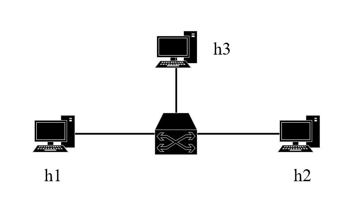

# Filter-Sketch
This is the code for the paper "Filter-Sketch: a two-layer sketch for entropy estimation in data plane".
The target architecture for this proof-of-concept code is the simple_switch variation of the P4 behavioral model software reference implementation.
# Introduction
this reposity aim to estimate entropy quickly and accurately in data plane
## Getting Started
we recommend using an Ubuntu 16.04 which is our experimental machine.
This work depends on P4
you need install bmv2, p4c, and so on. 
## topo
we have configure p4-switch that all packet coming form h1 are forwarded to h2. until the end of 
observation windows, the packet with estimated entropy value will froward to h3.  
so we can capture the packet from h3 to get the estimated entropy. Note, you need take h1 as the sender as follows.

#  1. get entropy from bmv2 with Filter-Sketch
## build environment
 open terminal, type``make cleean``  
 then type``make``
## send packet
 in mininet CLI, open h1 windows
``python scripts/source1.py``, you will get the estimated entropy caculated by bmv2 switch
    stored in ``s11-eth3_in.pcap``
## get entropy from specific field in targeted pcap file    
we provide a tool to get entropy field from targeted pcap file, "tools/run.exe".
   (also you can open pcap file with wireshark, get the corresponding value in the entropy field ) 
Open a terminal, run ``tools/run.exe``, you need follow the data address, for example, ``./run.exe ../pcaps/s11-eth3_in.pcap``
, note that the pcap file is produced by entropy estimation ,which include the "entropy" field.

After getting the entropy field, you need convert this field to "float" with defined format(you can find detail in entropy.p4)
 for example, the entropy field is "0x7d", we have provide a tool "tools/DataConvert/dataconvert.py" 

# 2. get the real entropy using tools
we have provided a tool(``tools/get_entropy_original_pcap.py``) to calculate real entropy of flow.   
you can change the filename, then run it.

# 3. get entropy with Euclid
we will compare our Filter-Sketch with Euclid which is released in [ddosd-p4](https://github.com/aclapolli/ddosd-p4)
   
